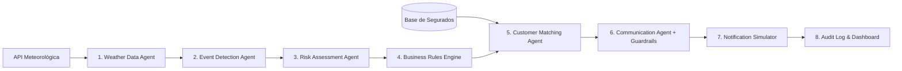

# 🛡️ Insurminds — Comunicação Proativa com o Segurado

> **Projeto**: Desafio 5 — I2A2 (Insurminds)  
> **Domínio**: Seguros + Inteligência Artificial + Meteorologia  
> **Slogan / Posicionamento**: *"From Reactive Insurance to Proactive Protection"*

---

## 📌 Visão do Produto

Tradicionalmente, seguradoras interagem com seus clientes de maneira **reativa** — quase exclusivamente após a ocorrência de um sinistro.

Eventos meteorológicos severos (como chuvas torrenciais, granizo e ventos fortes) podem ser previstos com antecedência. A plataforma **Insurminds** transforma previsões meteorológicas em **ações preventivas personalizadas**, protegendo o segurado e reduzindo a sinistralidade da seguradora.

A arquitetura desacopla rigidamente **dados externos**, **regras determinísticas de negócio** e **inteligência artificial generativa**, garantindo alta explicabilidade, rastreabilidade (Audit Trail) e proteção contra alucinações.

---

## 🚀 Como Executar o Projeto

### Pré-requisitos
- Python 3.10 ou superior
- Pip

### 1. Clonar e Instalar Dependências
```bash
git clone <url-do-repositorio>
cd Desafio5Insurminds
pip install -r requirements.txt
```

### 2. Configurar Variáveis de Ambiente (Opcional)
Copie o arquivo de exemplo:
```bash
cp .env.example .env
```
*(Nota: O sistema já possui integração gratuita com a API global Open-Meteo e um gerador contextual de contingência, funcionando perfeitamente mesmo sem chaves externas de API).*

### 3. Executar o Servidor FastAPI com Dashboard
```bash
python -m uvicorn app.main:app --reload --port 8000
```
Abra seu navegador em: **[http://localhost:8000](http://localhost:8000)**

### 4. Executar os Testes Automatizados
```bash
python -m pytest
```

---

## 🏗️ Arquitetura dos Agentes



1. **Weather Data Agent**: Normaliza coordenadas, temperatura, chuva (mm), vento (km/h) e flags de granizo/tempestade via Open-Meteo.
2. **Event Detection Agent**: Detecta eventos com thresholds configuráveis (Chuva >20/40/60 mm, Vento >60/80 km/h, Granizo, Tempestade).
3. **Risk Assessment Agent**: Calcula o **Preventive Insurance Score** (0–100) e classifica em Baixo, Moderado, Alto ou Crítico.
4. **Business Rules Engine**: Executa a matriz de regras determinísticas (Seção 10 e 11 do PRD) — a IA nunca decide sozinha quem comunicar.
5. **Customer Matching Agent**: Cruza a localização geográfica da tempestade com as apólices ativas dos segurados.
6. **Communication Agent**: Gera a mensagem com LLM adaptada à persona, canal e gravidade, submetendo-a imediatamente ao motor de **Guardrails**.
7. **Notification Simulator**: Renderiza a interface do canal preferencial do segurado (WhatsApp, Push, SMS, E-mail).
8. **Audit Trail**: Registra cada microrrequisito e decisão com timestamp no SQLite e memória.

---

## 🎯 Cenários de Demonstração (1 Clique no Dashboard)

- **Cenário A (Granizo + Auto em Brasília)**: Segurado João Porto recebe alerta crítico via WhatsApp para recolher o veículo para local coberto.
- **Cenário B (Chuva Intensa + Residencial em São Paulo)**: Segurada Helena Fontes recebe alerta via WhatsApp/SMS para vistoriar calhas e ralos.
- **Cenário C (Vento Forte + Residencial em Florianópolis)**: Segurado Carlos Eduardo recebe orientação preventiva via E-mail/WhatsApp para trancar janelas e remover objetos externos em área litorânea.
- **Cenário D (Chuva Leve / Evento Irrelevante em Curitiba)**: O sistema identifica risco baixo e **suprime** o disparo, demonstrando proteção contra spam de notificações.

---

## 📊 Estrutura de Pastas
```
├── app/
│   ├── agents/          # Agentes inteligentes modulares
│   ├── rules/           # Motor determinístico de regras de negócio
│   ├── services/        # APIs climáticas, LLM, guardrails e auditoria
│   ├── models/          # Schemas de dados Pydantic
│   ├── static/          # Dashboard Web com glassmorphism e simulador
│   ├── config.py        # Configurações e variáveis de ambiente
│   └── main.py          # FastAPI app e endpoints REST
├── data/
│   └── customers.csv    # Base realista de segurados
├── tests/               # Testes unitários com Pytest
├── Dockerfile           # Imagem para conteinerização
├── TECHNICAL_REPORT.md  # Relatório Técnico Completo (Seção 29)
└── requirements.txt
```
